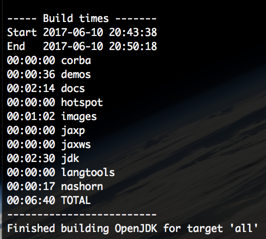

# JDK

openjdk8的编译需要jdk1.7作为引导jdk，如果系统已存在1.8版本的，那么我们首先需要将其卸载，Mac上jdk的卸载只需一条命令即可：

```shell
sudo rm -rf /Library/Java/JavaVirtualMachines/jdk1.8.0_131.jdk/
```

jdk的版本号根据实际情况进行调整即可，注意这样卸载之后在Mac的系统便好设置中仍然存在java的设置项，将其保留即可，因为Mac当检测到有新的jdk安装时，会将此选项对应到新的jdk上，那时此功能将重新可用。

1.7版本的jdk官方已不提供下载，下列地址可用：

[jdk-7u71-macosx-x64.dmg](http://download.csdn.net/download/sxsj333/8331551)

# XQuartz

编译之前需要先安装此依赖库，去官方网站下载dmg包直接安装即可：

[XQuartz](https://www.xquartz.org/)

# 设置

适用的参数命令如下：

```shell
./configure --with-debug-level=slowdebug --with-num-cores=2 --with-jobs=4 CC=clang CXX=clang++ --with-target-bits=64
```

CC参数用以指定编译使用的C++编译器，而clang是Mac默认的编译器。

## GCC未找到

报错的信息如下：

```shell
configure: error: GCC compiler is required. Try setting --with-tools-dir
```

网上有安装老版本XCode的方法，这里借鉴一个简单的方法，打开openjdk下的下列文件:

```shell
vim common/autoconf/generated-configure.sh
```

将第20061和21640行的以下内容注释掉:

```shell
as_fn_error $? "GCC compiler is required. Try setting --with-tools-dir." "$LINENO" 5
```

## freetype

编译依赖于此库，使用以下命令进行安装即可:

```shell
brew install freetype
```

同时在configure命令后追加以下两个参数:

```shell
--with-freetype-include=/usr/local/include/freetype2 --with-freetype-lib=/usr/local/lib/ 
```

至此，configure就可以完成了。

# 编译

命令:

```shell
make all COMPILER_WARNINGS_FATAL=false LFLAGS='-Xlinker -lstdc++' CC=clang USE_CLANG=true LP64=1
```

## relocInfo.hpp

全名为: share/vm/code/relocInfo.hpp

将第367由:

```c++
nline friend relocInfo prefix_relocInfo(int datalen = 0);
```

改为:

```c++
nline friend relocInfo prefix_relocInfo(int datalen);
```

将第462行由:

```c++
inline relocInfo prefix_relocInfo(int datalen) {
```

修改为:

```c++
inline relocInfo prefix_relocInfo(int datalen = 0) {
```

注意，具体的行号可能随jdk的版本而变化，应以具体的错误信息输出为准。

## 类重复

之前在Fedora上编译时也遇到过这个问题，解决方式就是将UNIXProcess.java重命名为UNIXProcess.java.linux，这个问题的出现原因应该是之前在阅读Process源码时将其重命名的，自己给自己挖的坑😡.

之后就可以顺利的编译成功了，截个图纪念下:



全部编译过程需要较高的CPU占用率，编译之后Mac都可以煎鸡蛋了🍳!

# 版本查看

编译得到的结果位于openjdk目录下的build/macosx-x86_64-normal-server-slowdebug中，里面的jdk目录便是我们喜，n闻乐见的jdk根目录，里面的java、javac等便是，你懂的。

执行命令:`./java -version`:

```shell
$ ./java -version
openjdk version "1.8.0-internal-debug"
OpenJDK Runtime Environment (build 1.8.0-internal-debug-skyalker_2017_06_10_20_19-b00)
OpenJDK 64-Bit Server VM (build 25.0-b70-debug, mixed mode)
```

带有我们的编译时间。

执行`./javac -version`:

```shell
$ ./javac -version
javac 1.8.0-internal-debug
```

# 使用

将我们编译得到的jdk路径添加到环境变量即可`vim ~/.zshrc `

```shell
# jdk
JAVA_HOME=/Users/skywalker/softwares/openjdk-8-src-b132-03_mar_2014/build/macosx-x86_64-normal-server-slowdebug/jdk
export JAVA_HOME
```

`source ~/.zshrc `之后就可以愉快的使用我们自己的jdk了。

# XCode

