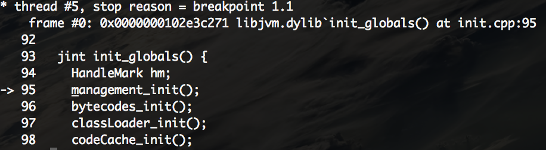

# 入口

不同于hotspots实战一书中所说的gamma调试入口，openjdk8已经将此launcher取消。openjdk8的入口位于hotspot目录同级的jdk目录下，在我的Mac上此目录为:

/Users/skywalker/softwares/openjdk-8-src-b132-03_mar_2014/jdk/src/share/bin/main.c

去掉为不同平台而设置的各种条件编译，main函数源码整理如下:

```c
int main(int argc, char **argv) {
    int margc;
    char** margv;
    const jboolean const_javaw = JNI_FALSE;
  	margc = argc;
    margv = argv;
    return JLI_Launch(margc, margv,
                   sizeof(const_jargs) / sizeof(char *), const_jargs,
                   sizeof(const_appclasspath) / sizeof(char *), const_appclasspath,
                   FULL_VERSION,
                   DOT_VERSION,
                   (const_progname != NULL) ? const_progname : *margv,
                   (const_launcher != NULL) ? const_launcher : *margv,
                   (const_jargs != NULL) ? JNI_TRUE : JNI_FALSE,
                   const_cpwildcard, const_javaw, const_ergo_class);
}
```

# lldb

看到的绝大多数调试命令都是基于gdb，但是在最新的Mac Sierra 10.12.5上，由于安全机制的变更以及其它的原因，即使添加了证书以及设置了信任，gdb命令仍然会报错，报错信息如下：

```shell
Inferior 1 (process 3412) exited normally
```

截止到目前(2017/6/14)，gdb仍没有一个可用的解决方案，所以在这里转为使用lldb进行调试，lldb是Mac上的默认调试器，使用方法以及和gdb的对比参考官方文档即可:

[The LLDB Debugger](https://lldb.llvm.org/tutorial.html)

下面是一次简单的调试过程:

- 启动，使用命令：

  ```shell
  lldb -f /Users/skywalker/softwares/openjdk-8-src-b132-03_mar_2014/build/macosx-x86_64-normal-server-slowdebug/jdk/bin/java
  ```

  -f参数用以指定调试目标的位置，其实在进入lldb之后再设置目标位置也可以，参考官方文档。

- 设置断点，使用命令:

  ```shell
  breakpoint set -f init.cpp -l 95
  ```

  -f参数指断点位于的文件，注意这里不必使用文件的绝对路径全名，-l参数用以指定行号。

- 运行，使用命令:

  ```shell
  run -version
  ```

  run其实是完整命令`process launch`的别名，这里很有意思的是run后面的参数等价于传递给java的参数，这样程序便会停在我们设置的init.cpp的95行，如下图：

  

- 调试命令：

  我们在IDE中用到的调试命令有以下三种，在lldb中也是一样的，只不过改为了输入命令的方式：

  - thread  step-in，其实就是"step into"，lldb中为其设置了别名：s/step.

  - thread step-over，单步跳过，lldb别名为n/next.

  - thread step-out，直接运行至结束，lldb别名为finish.

  - 变量查看，假设当前停留在下列代码出：

    ```c++
    static PerfVariable* create_variable(CounterNS ns, const char* name,
    	PerfData::Units u, TRAPS) {
    	return create_long_variable(ns, name, u, (jlong)0, CHECK_NULL);
    }
    ```

    我们要查看变量name的值，使用命令`expression name`即可。

# VSCode

我们可以利用VSCode进行调试，而不用重量级的IDE，对于启动过程的调试来说，我们需要在VSCode中打开目录：

/Users/skywalker/softwares/openjdk-8-src-b132-03_mar_2014/

之后点击Debug - Start Debug选项，VSCode会自动提示debug的类型，我们选择C/C++(gdb/lldb)即可，之后将自动弹出一个launch.json编辑窗口，我们需要改动以下几处:

-  "program": "/Users/skywalker/softwares/openjdk-8-src-b132-03_mar_2014/build/macosx-x86_64-normal-server-slowdebug/jdk/bin/java"，这里便是我们编译得到的可执行java命令的位置。
-  "args"，java命令的参数。
-  "cwd"，调试的工作空间，调试器将在此空间里寻找需要的头文件，默认为\\${workspaceRoot}，这样会报错，我们只需将反斜杠删掉即可。

