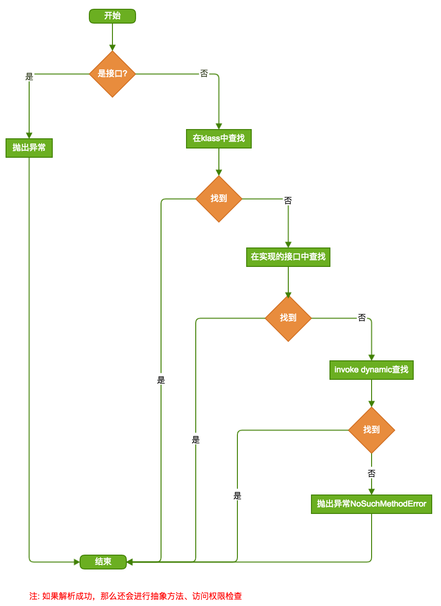

这部分看下方法解析的过程，源码位于jdk7u-hotspot-jdk7u6-b08/src/share/vm/interpreter/linkResolver.cpp的resolve_method方法。

# 流程概括



# 源码

这里只关注klass解析。lookup_method_in_klasses:

```c++
void LinkResolver::lookup_method_in_klasses(methodHandle& result, KlassHandle klass, Symbol* name, Symbol* signature, TRAPS) {
  methodOop result_oop = klass->uncached_lookup_method(name, signature);
  if (EnableInvokeDynamic && result_oop != NULL) {
    switch (result_oop->intrinsic_id()) {
    case vmIntrinsics::_invokeExact:
    case vmIntrinsics::_invokeGeneric:
    case vmIntrinsics::_invokeDynamic:
      // Do not link directly to these.  
      // The VM must produce a synthetic one using lookup_implicit_method.
      return;
    }
  }
  result = methodHandle(THREAD, result_oop);
}
```

jdk7u-hotspot-jdk7u6-b08/src/share/vm/oops/instanceKlass.cpp的uncached_lookup_method方法:

```c++
methodOop instanceKlass::uncached_lookup_method(Symbol* name, Symbol* signature) const {
  klassOop klass = as_klassOop();
  while (klass != NULL) {
    methodOop method = instanceKlass::cast(klass)->find_method(name, signature);
    if (method != NULL) return method;
    klass = instanceKlass::cast(klass)->super();
  }
  return NULL;
}
```

可以看出，这里在沿继承树向上查找。

```c++
methodOop instanceKlass::·find_method(objArrayOop methods, Symbol* name, Symbol* signature) {
  int len = methods->length();
  // methods are sorted, so do binary search
  int l = 0;
  int h = len - 1;
  while (l <= h) {
    int mid = (l + h) >> 1;
    methodOop m = (methodOop)methods->obj_at(mid);
    assert(m->is_method(), "must be method");
    int res = m->name()->fast_compare(name);
    if (res == 0) {
      // found matching name; do linear search to find matching signature
      // first, quick check for common case
      if (m->signature() == signature) return m;
      // search downwards through overloaded methods
      int i;
      for (i = mid - 1; i >= l; i--) {
        methodOop m = (methodOop)methods->obj_at(i);
        assert(m->is_method(), "must be method");
        if (m->name() != name) break;
        if (m->signature() == signature) return m;
      }
      // search upwards
      for (i = mid + 1; i <= h; i++) {
        methodOop m = (methodOop)methods->obj_at(i);
        assert(m->is_method(), "must be method");
        if (m->name() != name) break;
        if (m->signature() == signature) return m;
      }
      return NULL;
    } else if (res < 0) {
      l = mid + 1;
    } else {
      h = mid - 1;
    }
  }
  return NULL;
}
```

很明显了，对methods数据的二分查找，找到后对比参数列表，对比的过程就是简单的循环。